# Ecommerce de Tecnologia 🚀

> Projeto de e-commerce feito em Django para praticar conceitos de backend, frontend com Tailwind CSS, AJAX e JavaScript, seguindo boas práticas de PEP8 e arquitetura escalável.

## Índice

- [Diagrama de arquitetura](#diagrama-de-arquitetura)  
- [Funcionalidades](#funcionalidades)  
- [Modelagem de Dados](#modelagem-de-dados)  
- [Tech Stack](#tech-stack)  
- [Instalação](#instalação)
- [Capturas de Tela](#capturas-de-tela) 


---

## Diagrama de arquitetura

Antes de iniciar a codificação, o fluxo foi projetado no Whimsical.  
Você pode conferir o diagrama de desenvolvimento em:

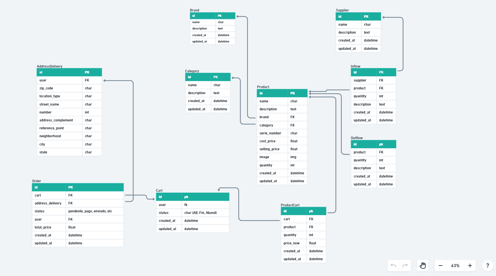

---

## Funcionalidades

- ✅ **Cadastro e listagem de produtos**  
- ✅ **Sistema de marcas e categorias** para evitar duplicidades  
- ✅ **Controle de entrada (inflows) e saída (outflows)** de estoque  
- ✅ **Carrinho de compras persistente** por usuário  
- ✅ **Finalização de pedidos** e geração de registros na tabela de `Order`  
- ✅ **Gestão de endereços de entrega** para cada usuário  
- 🚧 **Autenticação e autorização** (login, logout, registro)  
- 🚧 **Layout responsivo** com Tailwind CSS  

---

## Modelagem de Dados

1. **Brand**  
   Tabela de marcas cadastradas para evitar duplicidade de nomes (ex: “Logitech” vs “Logitec”).

2. **Category**  
   Classificação de produtos para filtros por categoria.

3. **Supplier**  
   Registro de fornecedores utilizados na tabela de Inflows.

4. **Inflows**  
   Controle de entrada de estoque: ao registrar uma entrada, soma-se a quantidade ao total disponível do produto.

5. **Product**  
   Cadastro dos produtos que estarão à venda.

6. **Outflows**  
   Ao finalizar uma compra, registra-se a saída na tabela e diminui-se o estoque disponível.

7. **Cart**  
   Carrinho persistente no banco: mantém itens adicionados mesmo que o usuário saia da sessão, para que sejam recuperados após novo login.

8. **ProductCart**  
   Associação entre `Cart` e `Product` para armazenar quais produtos e quantas unidades cada carrinho contém.

9. **Order**  
   Registros de pedidos finalizados.

10. **AddressDelivery**  
    Endereços de entrega cadastrados por usuário.

---

## Tech Stack

- **Backend:** Django  
- **Frontend:** Tailwind CSS, JavaScript, AJAX  
- **Banco de Dados:** SQLite (pode ser trocado para PostgreSQL/MySQL)  
- **Controle de Qualidade:** PEP8, flake8  

---

## Instalação

1. **Clone o repositório**  
   ```bash
   git clone https://github.com/marcus-nascimento98/ecommerce.git
   cd ecommerce
   ```

2. **Crie e ative um ambiente virtual**  
   ```bash
    python -m venv venv
    source venv/bin/activate     # Linux/Mac  
    venv\Scripts\activate.bat    # Windows
    ```

3. **Instale as dependências**  
   ```bash
    pip install -r requirements.txt
    ```

4. **Execute as migrations**  
   ```bash
    python manage.py migrate
    ```

5. **Execute as migrations**  
   ```bash
    python manage.py createsuperuser
    ```

---

## 🖼️ Capturas de Tela

### 📋 Tela Principal
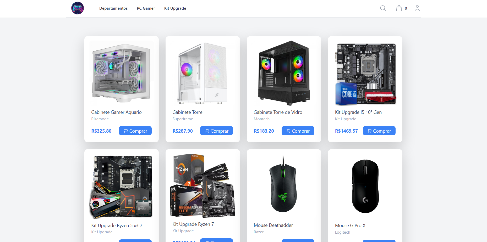

### 📋 Tela de Login
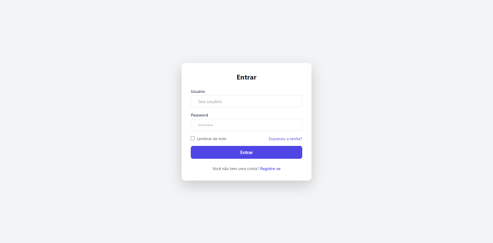

### 📝 Tela de Registro
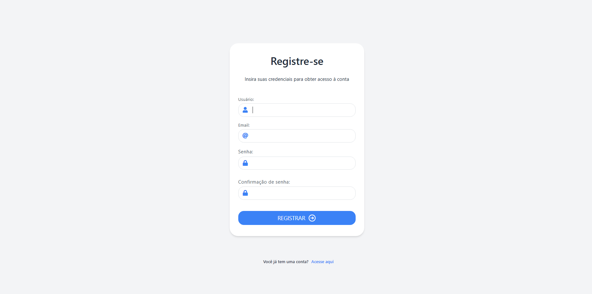

### 📝 Tela do Carrinho
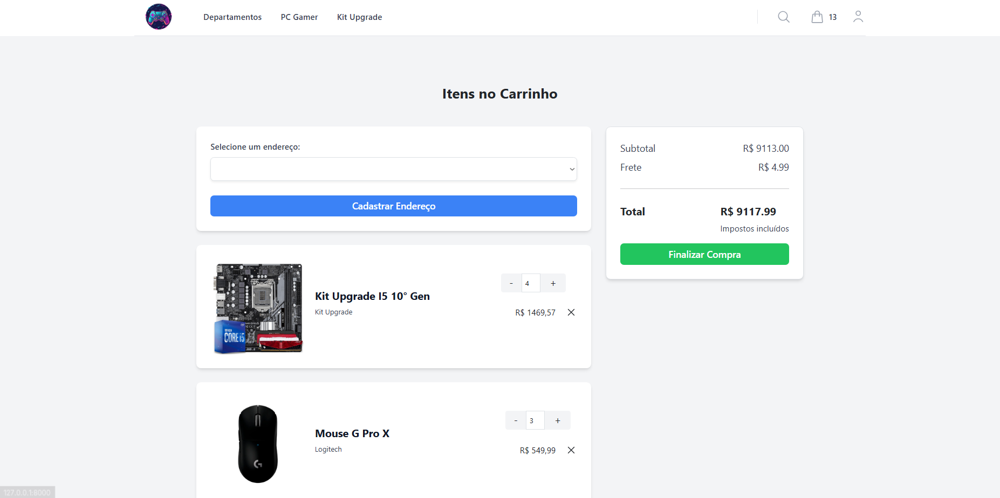

### 📝 Tela do Produto
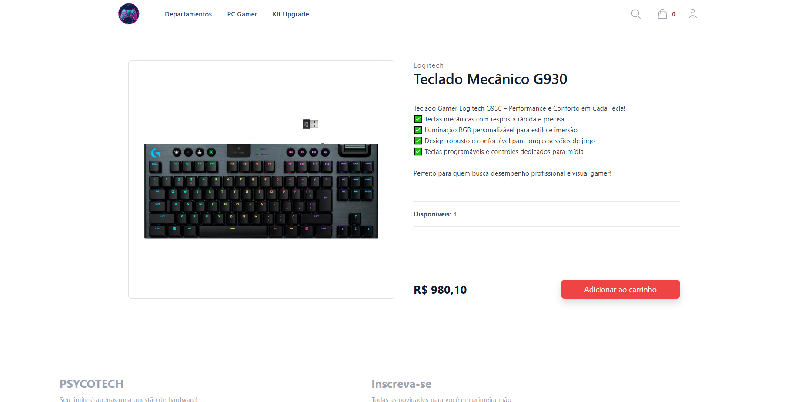

### 📝 Footer
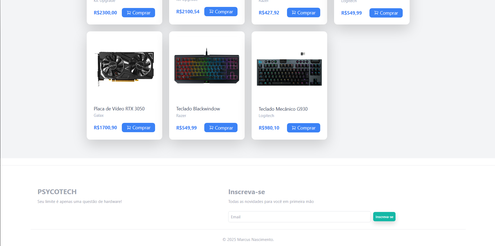

### 📝 Produto Adicionado ao Carrinho
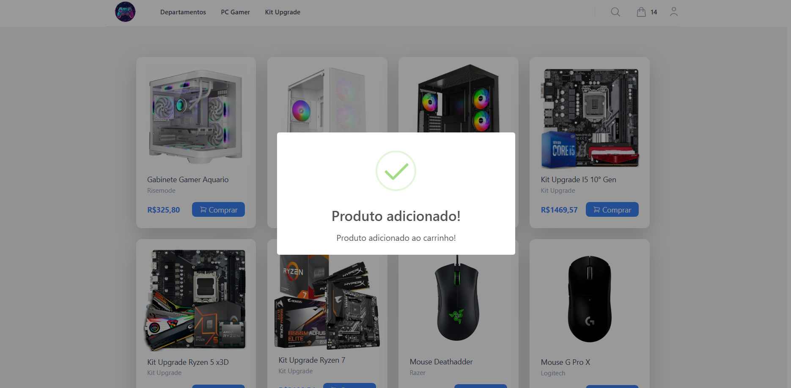

### 📝 Tela de Cadastro de Endereço
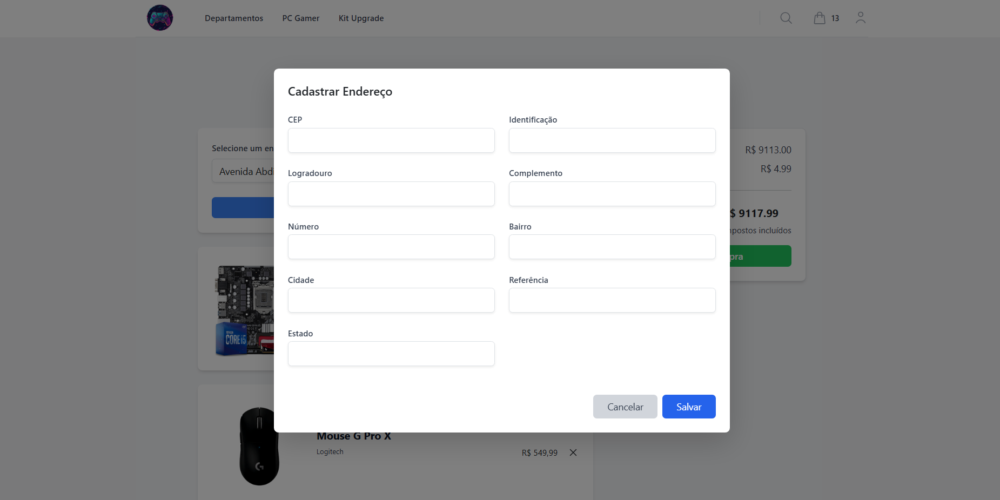

### 📝 Menu Dropdown
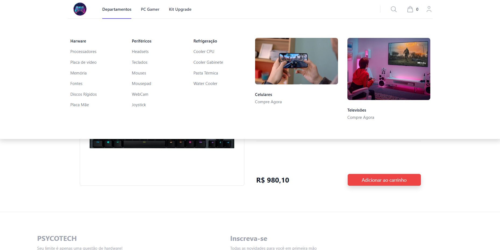

### 📝 Filtro
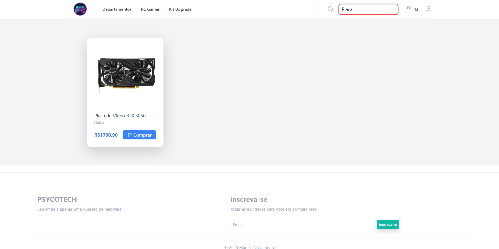

### 📝 Pedido Finalizado


### 📝 Tela de Entrada do Django Admin
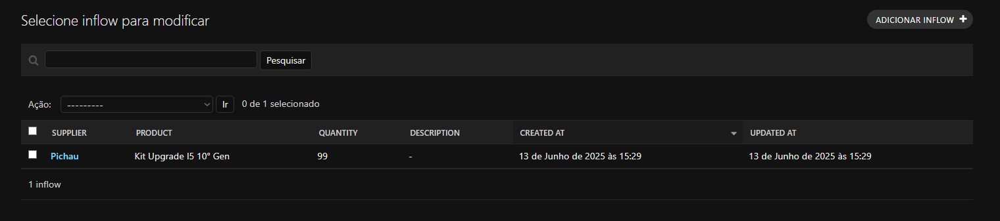

### 📝 Tela de Saída do Django Admin
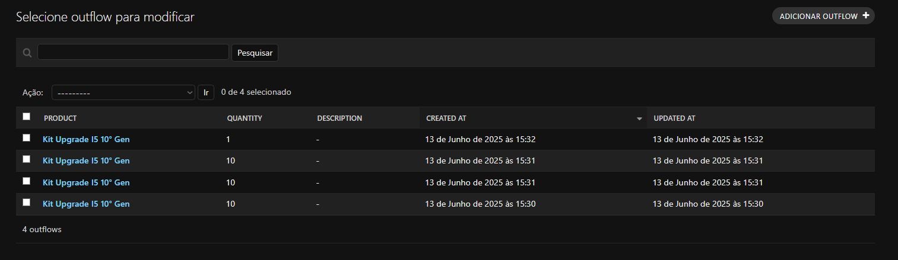

---

## 📌 Status

🚧 Projeto em desenvolvimento contínuo como prática e aprendizado em Django.

---

## 📬 Contato

Desenvolvido por **Marcus Vinícius Quintanilha**  
[LinkedIn](https://www.linkedin.com/in/marcus-nascimento98/) • [GitHub](https://github.com/marcus-nascimento98)
